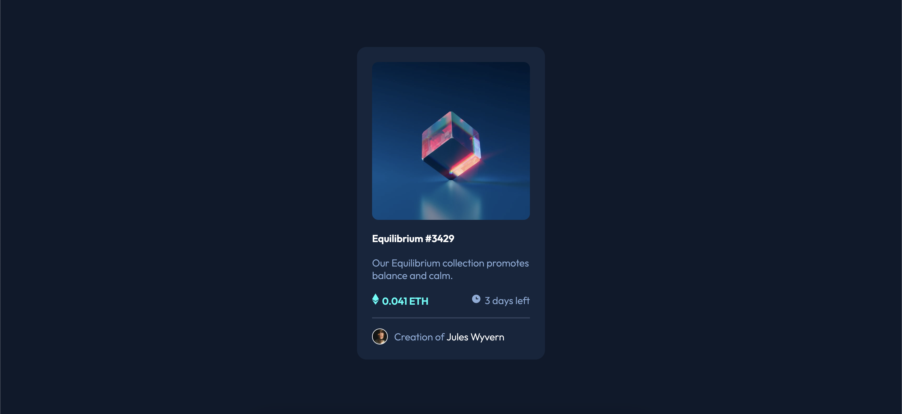

# Frontend Mentor - NFT preview card component solution


This is a solution to the [NFT preview card component challenge on Frontend Mentor](https://www.frontendmentor.io/challenges/nft-preview-card-component-SbdUL_w0U). Frontend Mentor challenges help you improve your coding skills by building realistic projects. 

## Table of contents

- [Overview](#overview)
  - [The challenge](#the-challenge)
  - [Screenshot](#screenshot)
  - [Links](#links)
- [My process](#my-process)
  - [Built with](#built-with)
  - [What I learned](#what-i-learned)
  - [Continued development](#continued-development)
  - [Useful resources](#useful-resources)
- [Author](#author)

## Overview

### The challenge

Users should be able to:

- View the optimal layout depending on their device's screen size
- See hover states for interactive elements

### Screenshot




### Links

- Solution URL: [https://github.com/gwencoding/nft-preview-card]
- Live Site URL: [https://nft-preview-card-gc.netlify.app]

## My process

### Built with

- Semantic HTML5 markup
- CSS custom properties
- Flexbox
- CSS Grid
- Mobile-first workflow

### What I learned

For this challenge I focus myself on hover effect,particularly image overlay effect.


See some code snippets, see below:

```css
.main-img-overlay{
    position: absolute;
    top:0;
    left:0;
    display: flex;
    justify-content: center;
    align-items: center;
    width:100%;
    height:100% ;
    border-radius: 10px;
    background: var(--Cyan);
    opacity:0;
    transition: opacity 0.25s;
}
```

### Continued development

I would learn new effects from picture to typography, it's great to have effects on your website to captivate your audience and keep fidelity. 
### Useful resources

- [Image Hover Text Overlay Effect](https://youtu.be/exb2ab72Xhs) - This helped me put a overlay effect on the image. There is so much ressources on youtube, consider this tactic before finding a solution of this or another challenge.

## Author

- Frontend Mentor - [@gwencoding](https://www.frontendmentor.io/profile/gwencoding)

